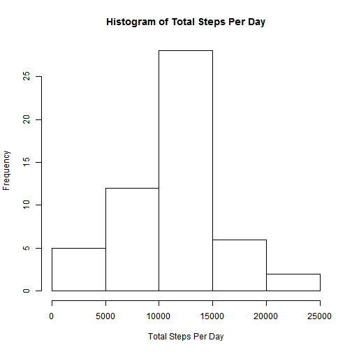
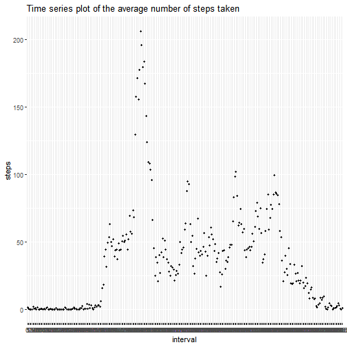
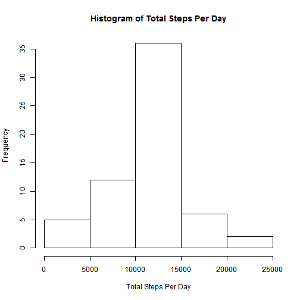
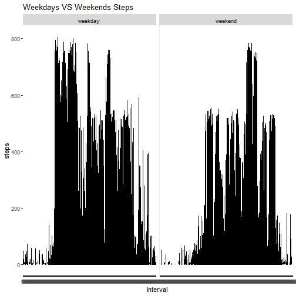

## unzip the file

```r
zipfile <- "repdata_data_activity.zip"
unzip(zipfile,files=NULL,list=FALSE,overwrite=TRUE,junkpaths=FALSE,exdir=".",unzip="internal",setTimes=FALSE)
```

## Q1 
## Read the file

```r
file <- read.csv("./activity.csv", header=TRUE)
```

## Q2
## crerate a file with sum of steps per day & give easy names to columns

```r
stepsum <- aggregate(file$steps, by=list(file$date), sum)
names(stepsum)[2] <- paste("steps_sum")
```

## create histogram to the total steps per day

```r
hist(stepsum$steps_sum,main="Histogram of Total Steps Per Day",xlab="Total Steps Per Day")
```



## Q3
## get the mean & median information

```r
summary(stepsum)
```

```
##        Group.1     steps_sum    
##  2012-10-01: 1   Min.   :   41  
##  2012-10-02: 1   1st Qu.: 8841  
##  2012-10-03: 1   Median :10765  
##  2012-10-04: 1   Mean   :10766  
##  2012-10-05: 1   3rd Qu.:13294  
##  2012-10-06: 1   Max.   :21194  
##  (Other)   :55   NA's   :8
```

## Q4
## create file with no missing values

```r
NoMissing <- file[!is.na(file$steps),]
```

## Create a file stepmean grouped mean of the steps in the file without missing data by interval

```r
stepmean <- aggregate(NoMissing$steps, by=list(NoMissing$interval), mean)
names(stepmean)[2]<-paste("meansteps")
names(stepmean)[1]<-paste("interval")
```

## create the graphic for average number of steps based on interval

```r
ggplot(stepmean,aes(x=factor(interval),y=stepmean$meansteps))+geom_point(lwd=1)+labs(x="interval",y="steps",title="Time series plot of the average number of steps taken")
```



## Q5
## The interval contains the max of steps

```r
stepmean[stepmean[2]==max(stepmean[2]),]
```

```
##     interval meansteps
## 104      835  206.1698
```

## Q6 
## collect the missing data into "missing"

```r
missing <- file[is.na(file$steps),]
```

## combine the missing data and the mean of the step data into one file based on the matching interval, and reordered the data by date & select out the columns based on the original file manner

```r
com <- merge (missing,stepmean, by="interval")
com <- com[order(com$date), ]
reorder<-com[,c(4,3,1)]
names(reorder)[1] <- paste("steps")
```

## combine the missing data with added values and the no missing data used before for collecting the mean of steps to create the final data final, and reorganize the final by date

```r
final <- rbind(NoMissing,reorder)
final <- final[order(final$date),]
```

## group out the sum of steps for each day

```r
final$date <- as.Date(final$date)
finalsum <- aggregate(final$steps, by=list(final$date), sum)
names(finalsum)[2] <- paste("steps_sum")
```

## Q7
## get the histogram for the steps per day

```r
hist(finalsum$steps_sum,main="Histogram of Total Steps Per Day",xlab="Total Steps Per Day")
```



## Get the general information for finalsum to see the mean, median, etc

```r
summary(finalsum)
```

```
##     Group.1             steps_sum    
##  Min.   :2012-10-01   Min.   :   41  
##  1st Qu.:2012-10-16   1st Qu.: 9819  
##  Median :2012-10-31   Median :10766  
##  Mean   :2012-10-31   Mean   :10766  
##  3rd Qu.:2012-11-15   3rd Qu.:12811  
##  Max.   :2012-11-30   Max.   :21194
```

## Q8
## Seperate out the weekdays and weekends by date information

```r
final["WW"] <- weekdays(as.Date(final$date))
final$WW[final$WW %in% c('Saturday','Sunday')] <- "weekend"
final$WW[final$WW!="weekend"] <- "weekday"
```

## Plot the comparison graphics for weekdays and weekends step pattern

```r
ggplot(final,aes(x=factor(interval),y=final$steps))+facet_grid(.~WW)+geom_line()+labs(x="interval",y="steps",title="Weekdays VS Weekends Steps")
```



